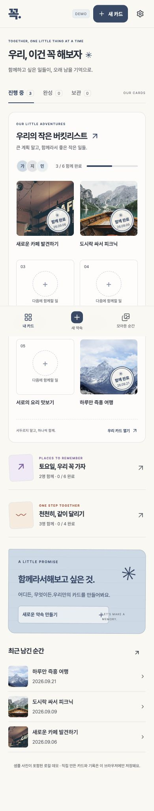

친구들이나 여자친구와 이야기하다 보면 이런 말을 자주 합니다.

> "우리 여기 다음에 꼭 가자."

또는

> "이거 우리 나중에 꼭 해보자."

문제는 보통 여기까지라는 겁니다.

그 순간에는 정말 갈 것 같고,

정말 할 것 같은데,

며칠 지나면 카카오톡 위로 밀려 올라가고,

몇 달 뒤에는 그런 말을 했는지도 잘 기억나지 않습니다.

## 꼭은 뭐 하는 앱인가

꼭은 한마디로 말하면 **함께 만드는 버킷리스트**입니다.

친구,

연인,

러닝 클럽,

동아리처럼

여러 사람이 같이 하고 싶은 일을 하나의 카드에 모을 수 있습니다.



예를 들면 이런 식입니다.

```text
우리 올해 꼭 할 것

□ 타우포 여행 가기
□ 새벽 러닝 해보기
□ 캠핑 가기
□ 같이 골프 치기
□ 사진관에서 단체사진 찍기
```

그리고 하나를 실제로 완료하면

체크 표시 하나로 끝나는 게 아니라

**사진과 도장**을 남깁니다.

```text
타우포 여행 가기

✅ 완료
📷 사진 3장
🔴 도장
```

하나씩 완료할수록 카드가 채워지고,

마지막 목표까지 끝나면 하나의 완성된 기록이 됩니다.

단순히 TODO를 관리하는 앱보다는

**"우리가 같이 뭘 했는지 남기는 앱"**에 조금 더 가깝습니다.

## 왜 또 TODO 앱을 만드는가

사실 해야 할 일을 기록하는 앱은 이미 정말 많습니다.

Todoist도 있고,

Notion도 있고,

Apple Reminders도 있습니다.

그런데 제가 만들고 싶었던 것은

**해야 하는 일**을 관리하는 앱이 아니었습니다.

```text
해야 할 일
→ 과제 제출
→ 장보기
→ 이메일 보내기

같이 하고 싶은 일
→ 여행 가기
→ 맛집 가기
→ 등산하기
→ 같이 공연 보기
```

둘은 비슷해 보이지만 느낌이 꽤 다릅니다.

첫 번째는 완료하면 없어지면 하는 것들이고,

두 번째는 완료한 뒤에도 남아 있으면 좋은 것들입니다.

꼭에서 완료 기록을 지우지 않고

사진과 도장을 남기고 싶은 이유도 여기에 있습니다.

**완료가 끝이 아니라 기록의 시작이었으면 했습니다.**

## 카드 하나를 같이 채운다

꼭에서 가장 중요한 단위는 **카드**입니다.

카드 하나에 같이 하고 싶은 목표를 넣고,

친구들을 초대합니다.

```text
카드 생성
   ↓
목표 추가
   ↓
친구 초대
   ↓
같이 실행
   ↓
사진 + 도장
   ↓
완성
```

처음에는 기능을 더 많이 넣을까도 생각했습니다.

하지만 Minimum Viable Product (MVP)에서는 최대한 단순하게 가기로 했습니다.

**카드를 만들고, 초대하고, 완료하고, 기록한다.**

일단 이 흐름 하나가 재미있는지를 확인하는 게 먼저라고 생각했습니다.

## Next.js + Supabase

현재 기술 스택은 비교적 단순하게 잡았습니다.

```text
Frontend
Next.js

Backend / Database / Auth / Storage
Supabase
```

처음에는 다른 Backend-as-a-Service도 고민했지만,

사용자 인증,

데이터베이스,

사진 저장,

초대 관계 등을 한 프로젝트 안에서 빠르게 만들기에는

Supabase가 가장 편하다고 판단했습니다.

꼭의 데이터 구조도 지금 단계에는 크게 복잡하지 않습니다.

```text
User
  ↓
Card
  ↓
Goal
  ↓
Completion
  ├── Photo
  └── Stamp
```

물론 앞으로 앱을 더욱 더 개발하면서

이 단순한 그림에 화살표가 점점 늘어날 가능성은 높습니다.

사이드 프로젝트에서

**"DB 구조는 단순합니다."**

라는 말은 보통 초반에만 유효한거 같습니다.

## 사진이 중심인 앱

꼭은 처음부터 텍스트보다 **사진이 많이 보이는 앱**으로 만들고 싶었습니다.

목표를 적는 것도 중요하지만,

나중에 다시 열어봤을 때

우리가 어디를 갔고,

누구와 있었고,

무엇을 했는지가 바로 보였으면 했습니다.

그래서 디자인을 생각할 때도

일반적인 TODO 앱보다는

사진 앨범이나 초대 카드에 가까운 느낌을 참고했습니다.

제가 원하는 느낌을 정리하면 이렇습니다.

```text
사진 중심 구조
+ 초대 카드의 개성
+ 도장판처럼 하나씩 채워지는 완성감
```

이 세 가지를 섞어서

**디지털인데도 실제 다이어리 한 장을 채우는 느낌**을 만들고 싶습니다.

## 도장을 넣은 이유

체크박스 하나만 있었다면 개발은 훨씬 쉬웠을 겁니다.

그런데 이름을 **꼭**이라고 정하고 나니

도장이 꽤 잘 어울렸습니다. (꾸욱 도장 찍는다 느낌)

하나를 완료할 때마다

```text
□
□
□
```

가

```text
🔴
🔴
□
```

처럼 채워지는 식입니다.

어렸을 때 "참 잘했어요" 도장을 하나씩 받으며 행복해 하던 것처럼

진행 상황 자체가 눈에 보였으면 했습니다.

사실 사람이란 생물은 생각보다 단순해서

도장 하나 찍히는 것도 꽤 기분이 좋습니다.

저는 그렇던데, 저만 그런가요?

## 처음에는 작은 그룹만

이런 서비스는 기능을 다 만든다고 검증되는 게 아닙니다.

결국 중요한 건

**실제로 사람들이 같이 쓰는가**입니다.

그래서 처음부터 많은 사용자를 생각하지 않고 있습니다.

친구 그룹,

연인,

러닝 모임,

교회 소그룹처럼

실제로 같이 무언가를 할 가능성이 높은 작은 그룹부터 테스트해볼 생각입니다.

누군가 카드를 만들었는데

아무도 목표를 추가하지 않는지,

초대 링크를 실제로 눌러보는지,

완료한 뒤 사진을 남기는지,

완성된 카드를 다시 보는지.

이런 게 지금은 기능 하나 더 만드는 것보다 훨씬 중요합니다.

## MVP에서 정한 범위

기능이 끝없이 커지는 걸 막기 위해

초기 버전에는 어느 정도 제한도 두려고 합니다.

```text
카드당 목표
1 ~ 12개

멤버
최대 20명

완료 기록
사진 최대 3장

상태
진행 중 / 완성 / 보관
```

그리고 기본적으로는 초대한 사람들만 카드를 볼 수 있도록 만들 생각입니다.

이 정도면

연인 둘이 만드는 데이트 버킷리스트부터

작은 동아리나 친구 그룹까지는 충분히 테스트해볼 수 있을 것 같습니다.

물론 만들다 보면

> "목표 12개는 너무 적은 거 아닌가?"

같은 생각이 들 가능성이 높습니다.

하지만 지금은 그 생각을 최대한 무시하려고 합니다.

## 이름은 왜 '꼭'인가

이 앱을 생각하면서 계속 반복해서 나온 말이 있었습니다.

> "이건 다음에 꼭 하자."

> "여기는 꼭 가보자."

> "올해는 꼭 해보자."

그래서 그냥 **꼭**이라고 부르려고 합니다.

영문으로는 **KKOK**.

짧고,

기억하기 쉽고,

앱의 의미와도 꽤 잘 맞는다고 생각합니다.

그리고 개인적으로 프로젝트 이름 정할때

계속해서 생각하고 후보 정하면서 시간 날리는 것보다

일단 하나 정하고 코드를 짜는 편이 정신 건강에 좋은 걸 

몇번의 사이드 프로젝트를 진행하며 깨달아버렸습니다.

## 지금 만들고 있다

현재는 아직 완성된 서비스가 아닙니다.

Next.js와 Supabase를 기반으로

가장 중요한 흐름부터 만들고 있습니다.

```text
카드 만들기
     ↓
친구 초대
     ↓
같이 목표 정하기
     ↓
완료
     ↓
사진 + 도장
     ↓
공유
```

이 흐름이 실제로 재미있는지가 첫 번째 목표입니다.

만약 사람들이 한 번 만들고 다시는 들어오지 않는다면

기능을 열 개 더 추가한다고 해결되는 문제는 아닐 겁니다.

반대로 단순한 버전인데도

친구들이

> "이런 기능도 하나 만들어줘."

라고 말한다면,

그때부터 조금 더 진지하게 만들어볼 수 있을 것 같습니다.

## 이번에는 '완성'보다 '사용'을 보고 싶다

사이드 프로젝트를 만들다 보면

개발자는 쉽게 기능 완성도를 목표로 삼게 됩니다.

페이지가 다 있고,

버튼이 다 작동하고,

DB가 잘 연결되면

뭔가 완성한 것 같은 기분이 듭니다.

하지만 이번 프로젝트에서는 조금 다르게 해보고 싶습니다.

**완성된 기능의 개수보다 실제로 남은 추억의 개수를 보고 싶습니다.**

친구들이 만든 카드 하나가

몇 달 뒤 사진과 도장으로 전부 채워져 있다면,

그게 이 프로젝트가 제대로 동작했다는 가장 좋은 증거일 것 같습니다.

어쩌다 보니 꽤 거창해졌지만,

결국 꼭이 하고 싶은 일은 하나입니다.

**말로만 남았던 '다음에 꼭'을 실제 추억으로 바꾸는 것.**